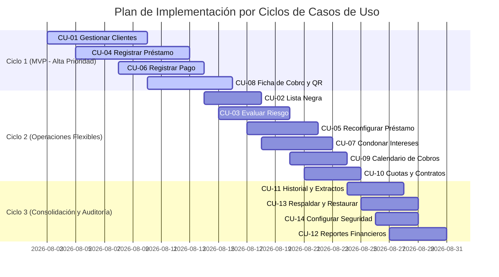

# Alcance del Sistema y Especificación de Casos de Uso - PasaKi

**Proyecto:** Desarrollo de una Aplicación Móvil para el Registro, Cobranza y Evaluación de Riesgo de Préstamos Personales (PasaKi)  
**Ubicación:** Santa Cruz de la Sierra, Bolivia  
**Plataforma / Stack:** Flutter / Dart (Arquitectura Local-First, almacenamiento local cifrado)  

---

## 1. Actores Involucrados

| Código | Actor | Rol en el Dominio | Descripción / Necesidad |
| :--- | :--- | :--- | :--- |
| **P** | **Prestamista Independiente** | Usuario Principal | Persona natural que otorga microcréditos con capital propio. Requiere automatización del cálculo de saldos (capital vs. interés), registro auditable de condonaciones, evaluación de riesgo crediticio y emisión ágil de cobros mediante QR sin depender de conexión a internet. |
| **D** | **Deudor / Cliente** | Beneficiario Indirecto | Comerciante, trabajador o persona que recibe financiamiento. Requiere transparencia y desglose exacto entre capital adeudado e intereses, evitando cobros arbitrarios y disponiendo de facilidades de pago digital por QR. |
| **G** | **Garante / Intermediario** | Garantía Social | Persona de confianza dentro de la red social/comunitaria que recomienda a un deudor o asume responsabilidad solidaria informal sobre la operación. |
| **SB** | **Sistema Bancario / QR** | Infraestructura Externa | Plataforma de pago interoperable (QR Simple) utilizada para la liquidación de transferencias directas entre las cuentas de banca móvil. |

---

## 2. Alcance Funcional

Requisitos Funcionales (RF) estructurados por módulos operativos:

### Módulo 1: Gestión de Clientes
- **RF-01: Registro de Clientes:** El sistema debe permitir el registro de nuevos clientes y la actualización de su información personal y de contacto.
- **RF-02: Asociar Garante o Intermediario:** El sistema debe permitir asociar a un deudor con otro cliente o persona de referencia para responsabilizar formalmente la operación bajo garantía social.
- **RF-03: Asociar Garantía Física:** El sistema debe permitir adjuntar la descripción de una garantía prendaria o física vinculada a un préstamo (ej. tarjeta de débito, bienes muebles) y gestionar su estado (pendiente, devuelta).
- **RF-04: Gestión de Lista Negra:** El sistema debe permitir marcar o desmarcar a un cliente en "Lista Negra". El sistema bloqueará de forma automática cualquier intento de registro de un nuevo préstamo a deudores en esta condición.
- **RF-05: Indicador de Confianza (Scoring de Riesgo):** El sistema debe calcular automáticamente un indicador visual de riesgo (verde, amarillo, rojo) por cliente, evaluando antigüedad, cumplimiento en pagos, días de morosidad y frecuencia de condonaciones solicitadas.
- **RF-06: Límite de Crédito:** El sistema debe emitir una advertencia al registrar un préstamo si el capital acumulado del cliente supera el límite máximo general o individual configurable.

### Módulo 2: Configuración y Lógica de Préstamos
- **RF-07: Registro de un Nuevo Préstamo:** El sistema debe permitir abrir nuevos préstamos asociándolos a un cliente existente o registrar de forma integrada un nuevo cliente si este no existiera.
- **RF-08: Configuración de la Tasa de Interés:** El sistema debe permitir definir la tasa de interés del préstamo en un período establecido (semanal, mensual, anual) en un rango del 0% al N%, con un valor base predeterminado del 20% (configurable).
- **RF-09: Renegociación de Tasa de Interés:** El sistema debe permitir modificar la tasa de interés de un préstamo activo, registrando obligatoriamente la fecha, la nueva tasa y el motivo del cambio para auditoría.
- **RF-10: Selección de Modalidad de Interés:** El sistema debe permitir elegir entre interés simple o compuesto al crear el préstamo, y modificar dicha modalidad durante el ciclo de vida registrando fecha y motivo del cambio.
- **RF-11: Estructura Separada de Saldos:** El sistema debe mantener de forma independiente e inalterable el saldo de capital respecto al saldo de interés acumulado por cliente.
- **RF-12: Cálculo Automático de Intereses:** El sistema debe liquidar automáticamente el interés generado en cada ciclo según la tasa y modalidad seleccionada, aplicándolo sobre el capital acumulado y saldos no cancelados.
- **RF-13: Acumulación de Préstamos:** El sistema debe permitir desembolsos múltiples a un mismo cliente dentro de un mismo período, consolidando de forma automática el capital adeudado total.
- **RF-14: Capitalización de Intereses:** En la modalidad de interés compuesto, el interés impago al cierre del período debe capitalizarse automáticamente sumándose al capital del siguiente ciclo.
- **RF-15: Congelación de Préstamos:** El sistema debe permitir pausar temporalmente la generación de nuevos intereses en un préstamo, exigiendo el registro de la fecha y motivo de la congelación.

### Módulo 3: Cobro, Pagos y Condonaciones
- **RF-16: Registro de Pagos:** El sistema debe permitir registrar abonos y pagos, permitiendo al prestamista imputar con precisión el monto abonado a capital, a interés o distribuirlo entre ambos.
- **RF-17: Generación del Contrato de Préstamo:** El sistema debe generar un documento contractual prellenado con los términos pactados (monto, tasa, modalidad, fechas, garantías y garante), exportable en formato PDF para su suscripción física.
- **RF-18: Cálculo de Cuota de Referencia:** El sistema debe simular y sugerir cuotas periódicas de amortización mediante sistemas reconocidos (Francés o Alemán) como valor de referencia.
- **RF-19: Condonación de Intereses:** El sistema debe permitir perdonar total o parcialmente intereses acumulados, registrando el monto teórico original, monto condonado, saldo restante, justificación y fecha del evento.
- **RF-20: Generación de Ficha de Cobro:** El sistema debe generar una ficha resumida y desglosada (capital pendiente, interés del ciclo, mora acumulada y total exigible) exportable a PDF o planilla de cálculo.
- **RF-21: Generación de Código QR de Cobro:** El sistema debe generar un código QR de cobro que incluya el monto exigible para facilitar transferencias directas desde aplicaciones bancarias locales.
- **RF-22: Alerta Visual de Mora:** El sistema debe desplegar alertas visuales en la interfaz principal para clientes que acumulen saldos vencidos de ciclos anteriores sin pago.
- **RF-23: Calendario de Cobros:** El sistema debe disponer de una vista de calendario con las fechas programadas de cobro y vencimientos, con soporte para recordatorios configurables.

### Módulo 4: Seguimiento, Historial y Reportes
- **RF-24: Vista de Vida del Préstamo:** El sistema debe presentar una línea de tiempo cronológica con desembolsos, devengamiento de intereses, pagos parciales y estado de saldo vigente.
- **RF-25: Historial de Movimientos:** El sistema debe registrar una bitácora inalterable de auditoría con todas las transacciones efectuadas (desembolsos, abonos, condonaciones, renegociaciones de tasa).
- **RF-26: Extracto de Cuenta de Cliente:** El sistema debe generar un extracto individual por deudor con el detalle histórico de fechas, conceptos y meses de mora acumulados.
- **RF-27: Búsqueda y Filtro de Clientes:** El sistema debe proporcionar búsqueda rápida por nombre y filtros por período (año, mes) y estado de cartera.
- **RF-28: Reporte de Saldos Activos:** El sistema debe generar un consolidado de clientes con deudas vigentes, segregando capital prestado e interés pendiente.
- **RF-29: Reporte Financiero:** El sistema debe calcular métricas de flujo de caja periódico (ingresos brutos por cobranza) y utilidad neta (cobros percibidos menos capital colocado).
- **RF-30: Reporte de Condonaciones:** El sistema debe emitir un consolidado del costo financiero por concepto de quitas o intereses condonados, comparándolo contra la ganancia neta.

### Módulo 5: Seguridad y Respaldo
- **RF-31: Persistencia de Datos en Local (Local-First):** La totalidad de las transacciones, almacenamiento relacional y reglas de negocio deben residir y ejecutarse de forma autosuficiente en el almacenamiento interno del dispositivo.
- **RF-32: Respaldo y Sincronización en la Nube (Opcional):** El sistema debe permitir respaldar y restaurar copias de seguridad de la base de datos en almacenamiento personal del usuario (Google Drive, Dropbox) bajo demanda o a intervalos configurables.
- **RF-34: Seguridad y Bloqueo de Acceso:** El sistema debe integrar autenticación local obligatoria (PIN, patrón o biometría del dispositivo) para impedir el acceso no autorizado a los registros patrimoniales.

---

## 3. Alcance No Funcional

Requisitos No Funcionales (RNF) organizados según atributos de calidad del software:

### Rendimiento y Eficiencia
- **RNF-01: Tiempo de Respuesta en Interfaz:** Las transiciones de pantalla, navegación entre módulos y consultas locales de deudores deben responder con latencias imperceptibles en hardware móvil de gama media y baja.
- **RNF-02: Velocidad de Cálculo Financiero:** La liquidación de intereses, actualización de saldos separados y consolidación de capital acumulado deben ejecutarse de forma casi instantánea al registrar o modificar movimientos.

### Seguridad y Privacidad
- **RNF-03: Control de Acceso Local:** Requerimiento ineludible de desbloqueo mediante credenciales locales (PIN, patrón o biometría) antes de exponer cualquier dato sensible de la cartera.
- **RNF-04: Cifrado de Datos Local:** La base de datos incrustada local (SQLite / SQLCipher) debe implementar cifrado en reposo para neutralizar accesos no autorizados a nivel de sistema de archivos.
- **RNF-05: Privacidad de la Información (Zero-Telemetry):** En estricto cumplimiento del principio local-first, la aplicación no transmitirá datos de clientes, saldos ni transacciones a servidores propietarios ni a terceros.

### Disponibilidad y Respaldo
- **RNF-06: Operatividad Offline (Local-First):** Disponibilidad operativa del 100% de las funciones principales sin requerir conectividad de red ni depender de servidores remotos.
- **RNF-07: Integridad Transaccional (ACID):** Todas las operaciones que afecten el estado financiero (pagos, renegociaciones, quitas) deben ser atómicas y consistentes, garantizando protección contra corrupción ante apagados abruptos.
- **RNF-08: Respaldo y Restauración de Información:** Los respaldos generados deben ser archivos cifrados exportables de forma manual o sincronizables con repositorios personales del usuario.

### Experiencia de Usuario y Usabilidad
- **RNF-09: Operatividad Rápida (Regla de los 3 Toques):** El flujo crítico de cobranza (apertura de ficha de cobro y despliegue del código QR) debe completarse en un máximo de 3 interacciones desde la pantalla principal.
- **RNF-11: Claridad Visual e Indicadores Cromáticos:** Uso de semaforización estándar (verde, amarillo, rojo) y tipografías de alto contraste para comunicar estados de morosidad y scoring crediticio sin ambigüedad.
- **RNF-12: Terminología Adaptada al Contexto Informal:** La redacción de etiquetas, conceptos y mensajes debe emplear vocabulario directo del microcrédito boliviano (ej. "Capital", "Interés del Mes", "Perdón de Deuda"), evitando formulaciones burocráticas o jerga bancaria.

---

## 4. Casos de Uso del Sistema

### 4.1. Catálogo de Casos de Uso

| Identificador | Nombre del Caso de Uso | Actor Principal | Requisitos Funcionales Trazables |
| :--- | :--- | :--- | :--- |
| **CU-01** | Gestionar Clientes | Prestamista (P) | RF-01, RF-02, RF-03, RF-27 |
| **CU-02** | Gestionar Lista Negra | Prestamista (P) | RF-04 |
| **CU-03** | Evaluar Riesgo de Deudores | Prestamista (P) | RF-05, RF-06 |
| **CU-04** | Registrar Préstamo | Prestamista (P) | RF-07, RF-08, RF-10, RF-11, RF-12, RF-13, RF-14 |
| **CU-05** | Reconfigurar Condiciones de Préstamo | Prestamista (P) | RF-09, RF-10, RF-15 |
| **CU-06** | Registrar Pago | Prestamista (P) | RF-11, RF-16 |
| **CU-07** | Condonar Intereses | Prestamista (P) | RF-19 |
| **CU-08** | Emitir Ficha de Cobro y Código QR | Prestamista (P) | RF-20, RF-21, RF-22 |
| **CU-09** | Gestionar Calendario de Cobros | Prestamista (P) | RF-23 |
| **CU-10** | Emitir Cuotas de Préstamo (Simulador) | Prestamista (P) | RF-17, RF-18 |
| **CU-11** | Consultar Historial y Extracto de Cuentas | Prestamista (P) | RF-24, RF-25, RF-26, RF-28 |
| **CU-12** | Generar Reportes Financieros | Prestamista (P) | RF-29, RF-30 |
| **CU-13** | Respaldar y Restaurar Datos | Prestamista (P) | RF-31, RF-32 |
| **CU-14** | Configurar Seguridad | Prestamista (P) | RF-34 |

---

## 5. Priorización de Casos de Uso por Ciclos de Desarrollo

La priorización responde al modelo de desarrollo iterativo e incremental, agrupando las funcionalidades en tres ciclos de entrega:

### Matriz de Priorización

| Identificador | Caso de Uso | Prioridad | Ciclo de Implementación | Justificación Técnica / Impacto |
| :--- | :--- | :---: | :---: | :--- |
| **CU-01** | Gestionar Clientes | **Alta** | **Ciclo 1 (MVP)** | Componente base del modelo de datos; indispensable para registrar transacciones. |
| **CU-04** | Registrar Préstamo | **Alta** | **Ciclo 1 (MVP)** | Núcleo de la colocación de capital y devengamiento de intereses. |
| **CU-06** | Registrar Pago | **Alta** | **Ciclo 1 (MVP)** | Flujo operativo esencial para amortización de capital e interés. |
| **CU-08** | Emitir Ficha de Cobro y Código QR | **Alta** | **Ciclo 1 (MVP)** | Valor diferencial inmediato frente a la libreta manual; agilización de cobranzas. |
| **CU-02** | Gestionar Lista Negra | **Media** | **Ciclo 2** | Regla de control crediticio para prevenir colocaciones de riesgo. |
| **CU-03** | Evaluar Riesgo de Deudores | **Media** | **Ciclo 2** | Algoritmo de confianza para categorizar visualmente a los clientes. |
| **CU-05** | Reconfigurar Condiciones de Préstamo | **Media** | **Ciclo 2** | Soporte a la naturaleza flexible del crédito informal (cambios de tasa/modalidad). |
| **CU-07** | Condonar Intereses | **Media** | **Ciclo 2** | Registro y formalización del perdón de intereses para evitar pérdida patrimonial. |
| **CU-09** | Gestionar Calendario de Cobros | **Media** | **Ciclo 2** | Herramienta de planificación operativa y recordatorios de cobro. |
| **CU-10** | Emitir Cuotas de Préstamo | **Baja** | **Ciclo 2** | Cálculo referencial de cuotas (Francés/Alemán) y generación de contrato PDF. |
| **CU-11** | Consultar Historial y Extracto | **Media** | **Ciclo 3** | Trazabilidad completa, auditoría de transacciones y estados de cuenta. |
| **CU-13** | Respaldar y Restaurar Datos | **Media** | **Ciclo 3** | Garantía de preservación de datos ante pérdida o recambio del terminal móvil. |
| **CU-14** | Configurar Seguridad | **Media** | **Ciclo 3** | Protección del acceso a la aplicación mediante credenciales biométricas o PIN. |
| **CU-12** | Generar Reportes Financieros | **Baja** | **Ciclo 3** | Consolidación de métricas de rentabilidad global y costo de condonaciones. |

---

## 6. Distribución de Esfuerzo y Objetivos por Ciclo

- **Ciclo 1 (MVP - Crítico):** Cobertura del 100% de las operaciones diarias de un prestamista independiente: dar de alta a una persona, prestar dinero, registrar abonos y mostrar el código QR para cobrar.
- **Ciclo 2 (Flexibilidad y Mitigación de Riesgos):** Incorporación de la lógica específica del crédito informal boliviano: garantías, quitas auditadas, renegociaciones sin perder consistencia contable y semaforización preventiva.
- **Ciclo 3 (Cierre, Seguridad y Auditoría):** Blindaje de la solución: autenticación local, respaldo cifrado de base de datos, bitácoras inalterables y métricas de rentabilidad neta.
